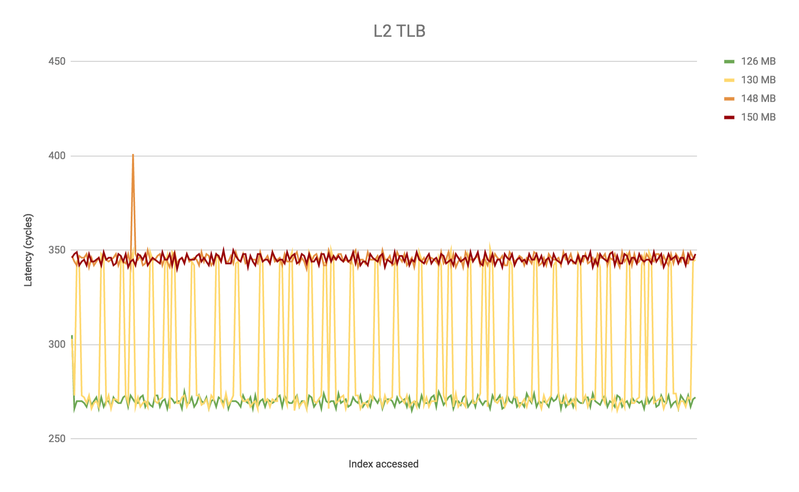
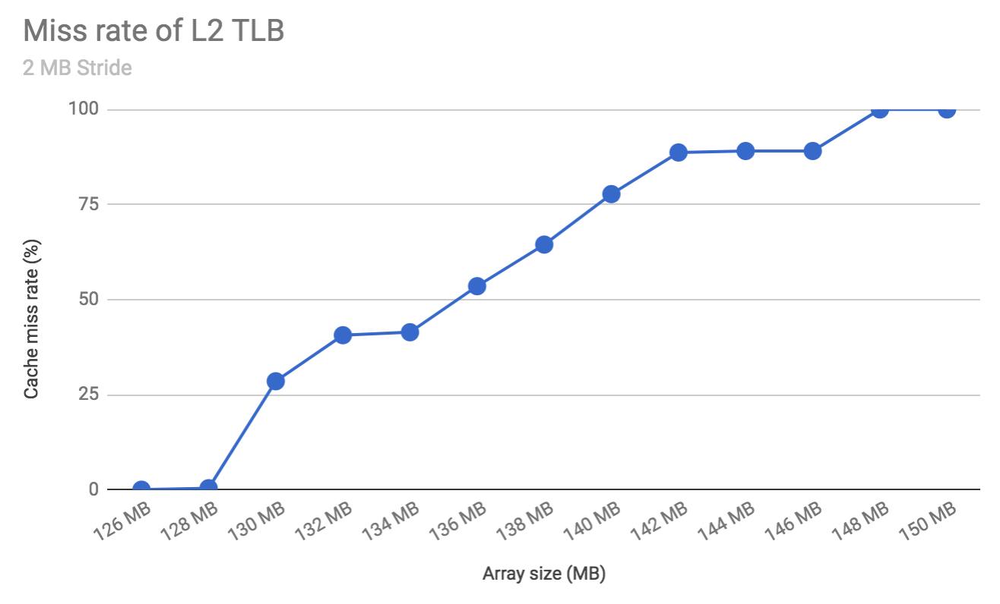
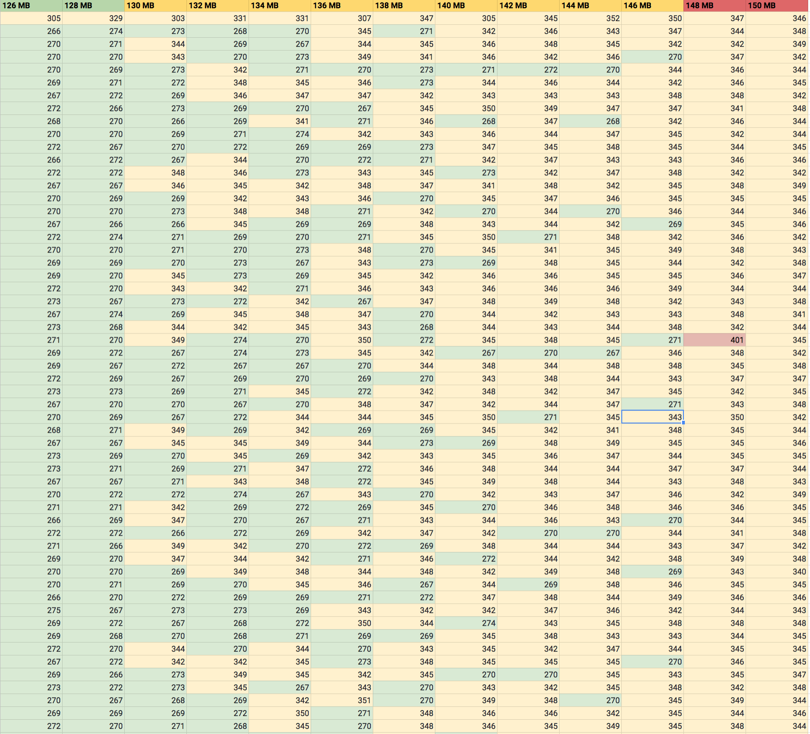
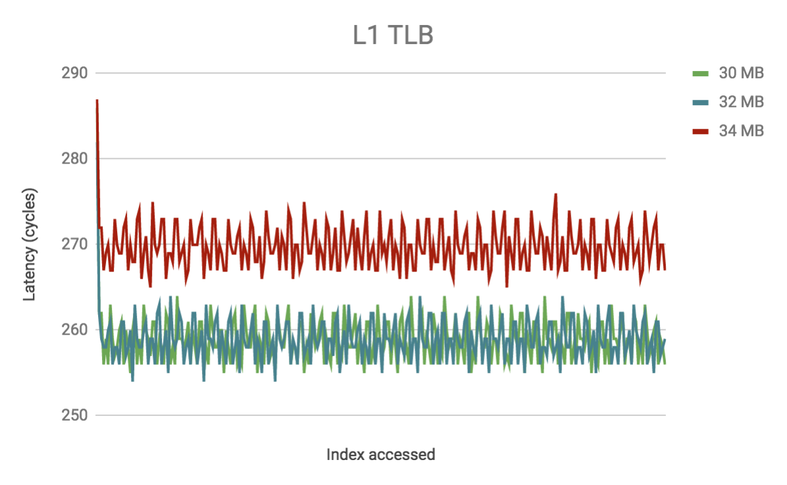

# Cuda Playground

## GeForce GTX TITAN X

### L2 TLB Analysis

Using maxwell_tlb.cu, generated 
<a href="http://docs.google.com/spreadsheets/d/16TDQx__41UWZUpeL4_CLbyOTJWQEf7zCG_WavlkNKws/edit?usp=sharing ">here</a> on *L2 sheet (Sheet 1)* 

L2 TLB cache size is 128 MB: 

### L1 TLB Analysis

Using maxwell_tlb.cu, generated 
<a href="http://docs.google.com/spreadsheets/d/16TDQx__41UWZUpeL4_CLbyOTJWQEf7zCG_WavlkNKws/edit?usp=sharing ">here</a> on *L1 sheet (Sheet 2)* 

L1 TLB cache size is 32 MB: 

